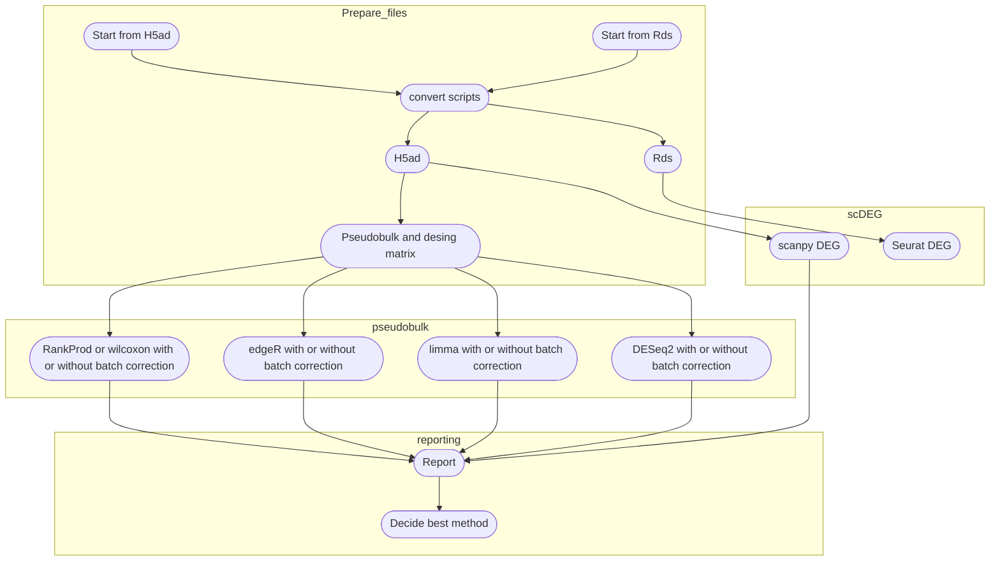

# Test_DEG_methods-single_cell


 Container and scripts to test different differential gene expression analysis methods


Several Differential Gene Expression analsyis methods exhist, single cell RNA-Seq bring new challenges to correctly identify the differentially expressed genes. This repo contains containers, scripts and notebook to run the analysis and check the results:
- Container: vergaju/test_deg contains
    - Seurat
    - DESeq2
    - limma
    - edgeR
    - RankProd (wilcoxon test)
    - sva/combat: batch correction
    - ClusterProfiler and GOsemsim: pathway enrichment analysis
    - other packages for visualization and data wrangling
- Rmd files:
    - Seurat
    - Run pseudobulk methods
    - Rmd to compile the report
- Python env:
    - Scanpy
    - pandas: create pseudobulks
- additional scripts:
    - convert Rds to H5ad and vice versa


## Usage:

Starting from an Rds file or a H5ad:
- Use the scripts to convert the files in the desired format
- Obtain the pseudobulks

### Single cell methods 

Use directly the Rds or H5ad files with scanpy or seurat

### Pseudobulk

Use the outputs from the notebook to obtain the pseudobulks as inputs of the DEG methods (pseudobulk = counts, esperimental desing = design matrix)

### Container:

Clone the repo and buil the container or
```
docker pull vergaju/test_deg
```

Usage:
```
docker run --rm -p 8888:8787 -e PASSWORD=pass -v $(pwd):/home/rstudio vergaju/test_deg
```

Open your browser at the address: 'localhost:8888', login with:
- username: rstudio
- password: pass (or select a preferred password)

**NOTE**: The container should be run in the same folder with the Rmd files#


### Mindmap:

